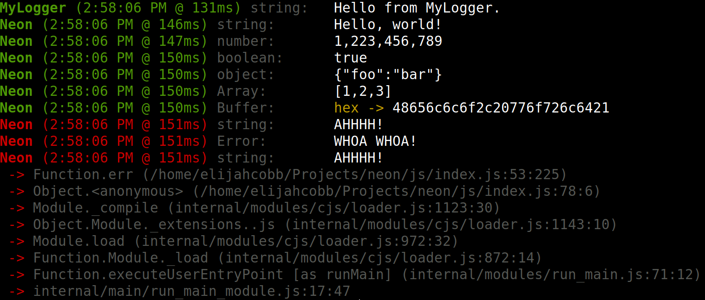

# neon

Welcome to the neon wiki! This is a work in progress and will be constantly updated. Below you will find pages to
this wiki but also feel free to view some nice features and information about the package.

[Want to buy my next coffee? :)](https://www.buymeacoffee.com/elijahjcobb)

## Summary
Neon is a simple package the provides really helpful logging. With even just the default options, Neon makes
`console.log()` look like a smudge on a rock. It provides the type of the logged value, the stack it came from, and
prints using the [colors](https://www.npmjs.com/package/colors) package.

In order to use Neon, once you import it, call `Neon.enable();`. The reason you have to enable it is so when you are
ready for logs to go away, all you have to do is remove that line, or call `disable()`.

#### Example
```typescript
import {Neon} from "@element-ts/neon";

Neon.enable();

Neon.setTitle("MyLogger");
Neon.log("Hello from MyLogger.");
Neon.clearTitle();
Neon.log("Hello, world!");
Neon.log(1223456789);
Neon.log(true);
Neon.log({foo: "bar"});
Neon.log([1, 2, 3]);
Neon.log(Buffer.from("Hello, world!"));

Neon.err("AHHHH!");
Neon.err(new Error("WHOA WHOA!"));
Neon.err("AHHHH!", true);
```



## About

### Language
All of Neon is written in [TypeScript](https://www.typescriptlang.org). If you do not know how to use TypeScript don't
worry. It is completely compatible with JavaScript.

### Why?
I kept writing the same kind of logging system in all of my projects.

### Author/Maintainer
My name is [Elijah Cobb](https://elijahcobb.com). I am a computer science student at
[Michigan Technological University](https://mtu.edu).